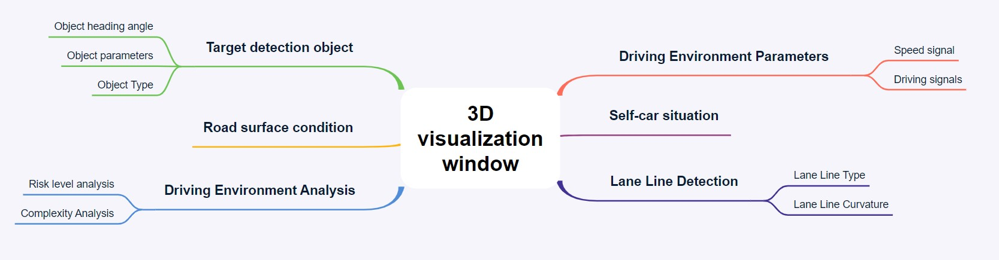

# 2022 Global Chinese Student Data Application Innovation Competition 3D Visualization Analysis


##### 	This project is based on PyOpenGL for 3D visualization and analysis of driving scenes, which can visualize and present multiple driving scenes, dynamically display the situation of self vehicles, roads, detected targets, etc., as well as the complexity of the current driving scenes and the degree of danger calculated based on the current driving environment and scenes. To facilitate real-time analysis of driving vehicles, roads, environment, etc.


## Visualization Analysis


Project Structure Diagram

 


Visualization Clip


### Requirements

- Windows10,  Python3(tested on 3.7.3)

```
pip install -r requirements.txt
```


